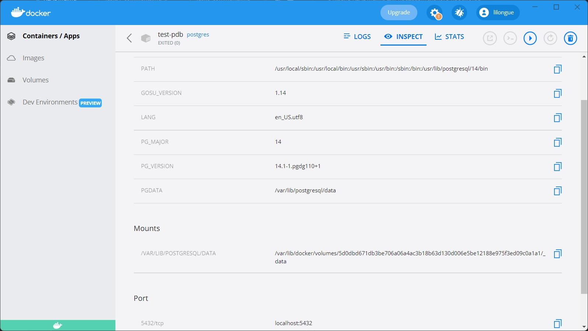

# SQLTask

## Используемый стенд

## Задание 1

#### _Спроектировать базу данных hh (основные таблицы: вакансии, резюме, отклики, специализации). По необходимым столбцам ориентироваться на сайт hh.ru_

---
## Задание 2

#### _Заполнить базу данных тестовыми данными (порядка 10к вакансий и 100к резюме)_

---
## Задание 3

#### _Написать запрос для получения средних значений по регионам ( area_id следующих величин: compensation_from , compensation_to , среднее_арифметическое_from_и_to)_

---

## Задание 4

#### _Написать запрос для получения месяца с наибольшим количеством вакансий и месяца с наибольшим количеством резюме_

---

## Задание 5

#### _Написать запрос для получения id и title вакансий, которые собрали больше 5 откликов в первую неделю после публикации_

---

## Задание 6

#### _Создать необходимые индексы (обосновать выбор столбцов)_

---
